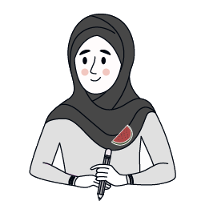
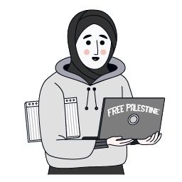

# Symbols Of Resistance

🎮 **Özgür Filistin** is a 2D strategy defense game inspired by the classic *Plants vs. Zombies* gameplay. Set during the Palestinian resistance, your mission is to defend the sacred site of Mescid-i Aksa by strategically placing defenders against waves of enemies. Use olive trees to generate resources and deploy unique fighters from the Palestinian resistance to stop the advancing Israeli forces.

---

## 🎥 Gameplay Video
*Include a link to your gameplay video here*

---

## 🎮 Gameplay Overview

In **Özgür Filistin**, you must protect Mescid-i Aksa from waves of enemies by strategically placing your units on a grid. Each unit has a unique ability:

- **Olive Tree:** Generates olives, the in-game currency.
- **Barrel:** Acts as a temporary barrier with health to block enemy advances.
- **Rock Thrower:** A child who throws stones at enemies, representing Palestinian resistance.
- **Shovel Fighter:** A woman who uses a shovel for close combat.
- **Slingshot Fighter:** A man in a wheelchair who attacks enemies with a slingshot.

**How to Play:**
1. Select a unit by clicking its button.
2. Click on a tile to place the unit.
3. Defend Mescid-i Aksa from enemies like Israeli soldiers, drones, and tanks.
4. Use olives to place more units and strengthen your defenses.
5. Mescid-i Aksa has 3 lives. If they are depleted, you lose.
6. Complete all waves of enemies to win the level!

---

## 🖼️ Screenshots

*Include your gameplay screenshots here*

---

## 🌟 Key Features

- **Unique Palestinian Fighters**: Play as iconic figures from the Palestinian resistance, each with their own abilities.
- **Resource Management**: Use olives generated by olive trees to place more units.
- **Wave-based Enemies**: Defend against waves of Israeli soldiers, tanks, drones, and other enemies.
- **Original Artwork**: All visuals are hand-drawn by our team.
- **Strategic Gameplay**: Plan your defenses carefully to protect Mescid-i Aksa.

---

## 🛠️ Technologies Used

- **Unity Engine**: Built using Unity for cross-platform compatibility (WebGL, Android, PC).
- **EpicToonVFX**: For visual effects.
- **DOTween**: For smooth animations and transitions.
- **Freesound.org**: Used for in-game sound effects.
- **Palestinian Music**: Authentic tracks representing Palestinian culture and history.

---

## 🌐 WebGL Demo

*Include a link to your WebGL demo here*

---

## 📚 Architecture & Design

**Manager-Based Design**:
- **AudioManager.cs**: Handles all in-game sound effects and music.
- **ParticleManager.cs**: Manages all particle effects in the game.
- **EnemyManager.cs**: Controls the spawning of enemy waves and tracks progress.
- **LevelManager.cs**: Oversees the level logic, including win/lose conditions.
- **TileManager.cs**: Manages the grid tiles where units are placed.
- **UnitManager.cs**: Handles the logic for deploying and controlling player units.
- **Selector.cs**: Responsible for selecting and placing units on the grid.

---

## 📊 Game Flow

1. **Wave Progression**: Enemies come in waves. After each wave, you have a brief moment to strategize and place more units.
2. **Unit Placement**: Use your olives wisely to place units in strategic positions.
3. **Victory/Defeat**: Successfully fend off all waves to win the level. If Mescid-i Aksa loses all its health, the game is over.

---

## 👨‍💻 Team Members

|  |  |  |
|:--:|:--:|:--:|
| [Erkan Yaprak](https://www.linkedin.com/in/erkanyaprak/)   *Game Developer + Game Designer* | [Şeyda Nur Yaşarsoy](https://www.linkedin.com/in/seydanuryasarsoy/)   *Game Designer + 2D Artist + Environment Artist + UI/UX Designer* | [Süheyla Yazıcı](https://www.linkedin.com/in/suheyla-yazicioglu/)   *2D Artist + Character Artist* |

---

## Contact Information

If you have any questions, feedback, or suggestions, feel free to contact us:

- **Erkan Yaprak**: [erkanyaprak@example.com](mailto:erkanyaprak@example.com)
- **Şeyda Nur Yaşarsoy**: [seydanuryasarsoy@example.com](mailto:seydanuryasarsoy@example.com)
- **Süheyla Yazıcı**: [suhyla.yazici@example.com](mailto:suhyla.yazici@example.com)

---

## Additional Resources

- **ErkanYaprak_UnityHelpers Package**: A custom Unity package including ObjectPool, MonoSingleton, GameStateManager, PopUpTextManager, and more. [Check out the repository here](https://github.com/ErkanYaprak/UnityHelpers).
